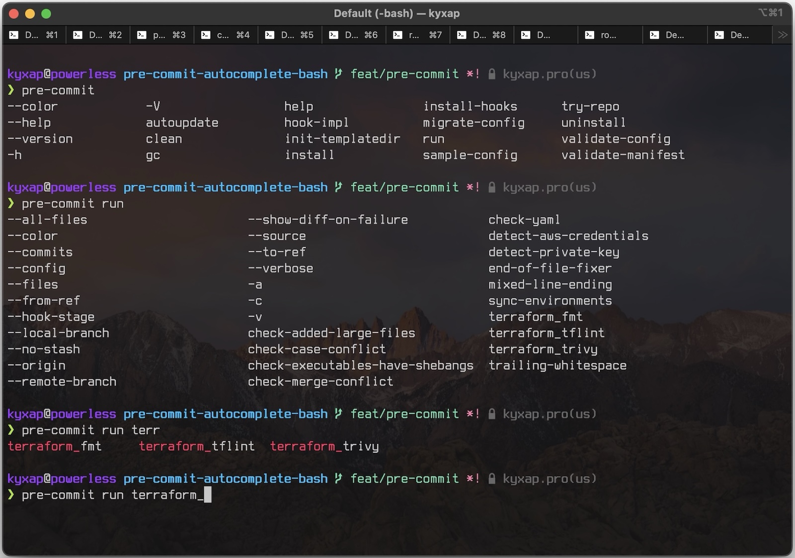

# Bash Autocompletion for pre-commit

Glory to Robots! 🤖
Special thanks to Antigravity and Gemini for making this possible.

## Installation (macOS & Linux)

### 1. Download the script
Store the completion script in a standard location, for example `~/.bash_completion.d/`:

```bash
mkdir -p ~/.bash_completion.d
cp pre-commit-completion.bash ~/.bash_completion.d/
```

### 2. Configure Bash
Add the following to your `~/.bashrc` (Linux) or `~/.bash_profile` (macOS):

```bash
# Load pre-commit completion
if [ -f ~/.bash_completion.d/pre-commit-completion.bash ]; then
    . ~/.bash_completion.d/pre-commit-completion.bash
fi
```

### 3. Apply changes
Restart your terminal or run:
```bash
source ~/.bash_profile  # or ~/.bashrc
```

<p align="center">
  
</p>


